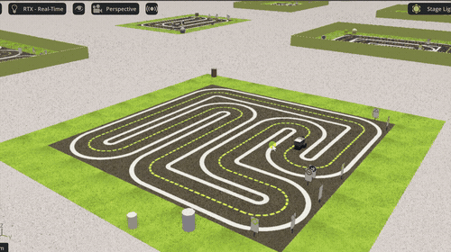
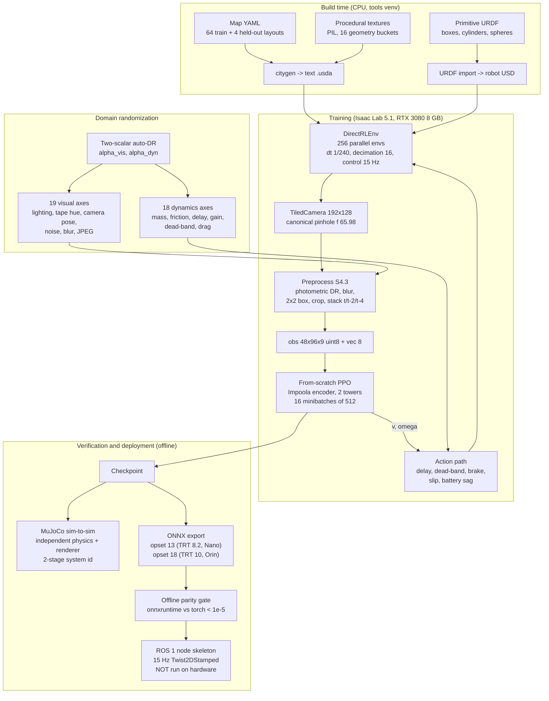

# duckiebot-rl

**Vision-based lane following for a Duckiebot, trained from scratch in Isaac Lab and verified in MuJoCo.**

[](https://github.com/MickyasTA/Issac_based_Duckiebot/actions/workflows/ci.yml)
[](LICENSE)
[](https://www.python.org/downloads/release/python-3114/)
[](#clean-room-assets)
[](#method)



*The trained policy driving in Isaac Sim: 20 procedurally generated cities, one vision policy,
the real DB21 robot model. Full clip: [assets/isaac_duckie_demo.mp4](assets/isaac_duckie_demo.mp4).*

**Pretrained policy included.** [`models/lanefollow_v1/`](models/lanefollow_v1/) ships the trained
weights, TorchScript, and ONNX for both Jetson targets, with the full input/output contract and
runnable inference snippets. Measured in MuJoCo, a different physics engine and renderer than it
trained in: **18.29 m median, 2.18 laps, 3.28 cm lane RMS, 100% success** over 120 episodes.

A 1.1 kg differential-drive robot learns to keep a lane from raw camera pixels, in a miniature
city that is generated procedurally, randomized aggressively, and never contains a single
downloaded asset. The PPO implementation is written from scratch in PyTorch: no
Stable-Baselines3, no rl_games, no skrl, no tianshou. The policy is then dropped into a
completely different physics engine (MuJoCo) and a completely different renderer to measure how
much of the learned behaviour was real and how much was overfitting to one simulator. The whole
thing runs on a single laptop RTX 3080 with 8 GB of VRAM, on Windows.

> **Status: in development.** The specification is frozen, the infrastructure and the offline
> deployment path are implemented and tested, and training runs have not been executed yet.
> Every number in the results table below is marked `TBD` until it comes out of a real run.
> Nothing in this repository has ever run on physical hardware, and the documentation says so
> everywhere it matters.

---

## Why this project is interesting

Most sim-to-real lane-following demos take a pretrained encoder, a published simulator, an
off-the-shelf PPO, and downloaded assets. This one deliberately removes all four crutches:

| Usual shortcut | What this project does instead |
|---|---|
| `stable-baselines3.PPO(...)` | ~800 lines of PyTorch: GAE with an exact truncation bootstrap, KL-adaptive learning rate, terminal-observation capture, and five silent-failure guards that assert the things PPO gets wrong quietly |
| Downloaded robot and city meshes | Every shape is a primitive or is generated at build time. A CI job fails the build if a mesh file ever appears |
| One simulator, one renderer | Isaac Lab for training, MuJoCo for an independent physics and rendering check, with a two-stage system identification between them |
| "It transfers, trust us" | A frozen 8-condition evaluation protocol, written before any tuning, with pre-committed decision rules |

---

## Architecture



The single most important structural decision: **one canonical camera**. Isaac renders it,
MuJoCo renders it, and the robot rectifies straight to it, so the three pipelines are identical
by construction rather than by coincidence. Every resampling step downstream of it is shared
code, and the ONNX graph carries a copy that is proven byte-identical to the training one.

---

## Quickstart (Windows 11)

This project is Windows only. There is no Linux or WSL fallback, by design and by decision.

```powershell
git clone https://github.com/MickyasTA/Issac_based_Duckiebot.git
cd Issac_based_Duckiebot

# One-shot machine setup: GPU TDR watchdog, sleep/hibernate, per-venv packages.
# Run from an ELEVATED PowerShell, then reboot. See docs/setup_windows.md for what it does.
.\scripts\setup_windows.ps1

# The Isaac venv is pre-existing and is NOT created by this repository.
$ISAAC = "d:/Personal/personal/wheeled_quadruped_robot/.venv/Scripts/python.exe"

# CPU-only checks: no Isaac, no GPU, no robot needed.
& $ISAAC -m pip install -e ".[dev,export,cv]"
& $ISAAC scripts/check_clean_room.py          # licensing gate, must exit 0
& $ISAAC -m pytest tests/unit -q              # the CPU test suite (exactly what CI runs)
& $ISAAC -m pytest tests/unit/test_ppo_learns.py --runslow   # the PPO learning gate, ~3 min

# Build the assets. Generated USD and textures are gitignored and rebuilt locally.
# The city generator needs only numpy, pyyaml and a USD runtime (`usd-core`, or the one inside
# Isaac Sim): no torch, no GPU, no Kit boot. That is why CI can build the whole city on Linux.
& $ISAAC scripts/build_robot_asset.py                  # primitive URDF from the dimensions
& $ISAAC tools/import_urdf_headless.py                 # URDF -> assets/usd/duckiebot.usda
& $ISAAC scripts/build_city.py --all --out assets/usd  # 64 training + 4 held-out layouts

# Train. 64 layouts, one per environment, all feeding a single policy.
& $ISAAC scripts/train.py --task Duckiebot-LaneFollow-v0 --num_envs 256 --headless --enable_cameras

# Train WITH the Isaac window open, to watch all N robots drive while they learn. Drop
# --headless and keep --enable_cameras (the policy is camera-driven; without it there is no
# observation). The viewport costs both VRAM and system commit, so cut the environment count:
# 64 is measured to fit alongside the GUI on an 8 GB card. One Kit process at a time.
& $ISAAC scripts/train.py --task Duckiebot-LaneFollow-v0 --num_envs 64 --num-variants 64 `
    --enable_cameras --resume latest

# Export a trained policy for both Jetson targets, with preprocessing baked in.
& $ISAAC scripts/export_policy.py --checkpoint checkpoints/best.pt --out-dir exports/
```

Full setup, including the registry change and the Isaac venv layout, is in
[docs/setup_windows.md](docs/setup_windows.md).

### The robot asset build, in three steps

`tools/import_urdf_headless.py` is the whole chain in one command, and the three tools under
`tools/` can also be run on their own:

```powershell
& $ISAAC tools/import_urdf_headless.py     # URDF -> import -> patch -> verify, about 20 s
& $ISAAC tools/patch_usd.py --dry-run      # what the patch step would change, without writing
& $ISAAC tools/verify_usd.py               # re-check an existing asset; exit 0 pass, 1 fail
```

| Step | What it does | Why it is a separate step |
|---|---|---|
| import | Boots Isaac Sim headless and drives the raw `isaacsim` URDF commands (`URDFCreateImportConfig`, `URDFParseFile`, `URDFImportRobot`). | Isaac Lab's `UrdfConverter` calls `set_merge_fixed_ignore_inertia()`, which the URDF importer shipped with Isaac Sim 5.1 (v2.4.30) does not have, so it raises `AttributeError` before importing anything. |
| patch | Binds the two physics materials (wheels mu 1.0 combine max, caster mu 0 combine min) and replaces a wheel cylinder collider with a sphere if the importer ever emits one. | An unbound caster silently keeps the PhysX 0.5/0.5 default, which costs yaw response in a way that looks like a policy problem forever. |
| verify | Asserts the M1 acceptance quantities: 3 bodies, 2 DOF, masses 1.00/0.05/0.05 kg, caster sphere r 0.0165 m with its centre exactly one radius above the ground, chassis box underside at 21 mm, no `Mesh` prim anywhere. | Exit code 1 on any failure, so it is usable as a build gate and as the M1 sign-off. |

The output is a single text `assets/usd/duckiebot.usda`. It is a build artifact: `assets/usd/` is
gitignored and rebuilt from the URDF by the command above. It is text rather than binary USD
because the clean-room gate bans `.usd`, `.usdc` and `.usdz` repository-wide, and the importer's
native output is binary, so the build flattens it into one readable layer and deletes the binary
staging directory. `python scripts/check_clean_room.py` passes with the asset present.

The assertion logic of `verify_usd.py` is tested on synthetic scenes in
`tests/unit/test_verify_usd.py`, which needs neither Isaac Sim nor USD, so CI runs it.

---

## Results

**All numbers are TBD until the training runs execute.** They are listed here with their
frozen definitions so that the table cannot be quietly redefined after the fact. Reported
quantity is the median with interquartile range across 200 episodes per condition, then mean
and standard deviation across 3 seeds, on 4 held-out maps that no training run ever sees.

### Transfer matrix

| Condition | What it measures | Lane-frame distance (m) | Survival (s) | Collisions/min | Lane RMS (m) |
|---|---|---|---|---|---|
| C0 | Isaac, no domain randomization | TBD | TBD | TBD | TBD |
| C1 | Isaac, in-distribution DR | TBD | TBD | TBD | TBD |
| C2 | Isaac, held-out-interior DR (memorization probe) | TBD | TBD | TBD | TBD |
| C3 | Isaac, 1.5x extrapolated DR | TBD | TBD | TBD | TBD |
| C4 | Isaac, 2.0x extrapolated DR | TBD | TBD | TBD | TBD |
| C5 | **MuJoCo, nominal (independent physics + renderer)** | TBD | TBD | TBD | TBD |
| C6 | MuJoCo with its own DR | TBD | TBD | TBD | TBD |
| C8 | Isaac fisheye render + robot-style rectification | TBD | TBD | TBD | TBD |

The headline is the **C1 to C5 gap**: how much performance survives a change of physics engine
and renderer. It is a robustness probe across independent implementations, not a prediction of
real-world performance, and it is framed that way everywhere in this repository.

### Ablations (3 seeds each, 60M steps, lane-following stage only)

| Ablation | Hypothesis | C1 | C5 | Verdict |
|---|---|---|---|---|
| Full DR (reference) | - | TBD | TBD | TBD |
| No DR | Collapses on transfer | TBD | TBD | TBD |
| Visual DR only | Survives renderer change, not physics change | TBD | TBD | TBD |
| Dynamics DR only | Survives physics change, not renderer change | TBD | TBD | TBD |
| Fixed-wide DR (no curriculum) | Expected training collapse | TBD | TBD | TBD |
| No actuation latency | Best in sim, worst on transfer | TBD | TBD | TBD |

### Decision rules, pre-committed

These were written before any run and are not negotiable afterwards: C2 within 10% of C1;
C3 within 25%; C5 and C6 within 30%; C8 within 25%; CVaR-10 of distance at least 0.4x the
median; no cliff in any 1-D sensitivity sweep inside the training range.

---

## Method

### From-scratch PPO

Pure PyTorch, zero reinforcement-learning libraries, CPU-testable, no Isaac imports anywhere in
the learner.

* **Networks.** Separate actor and critic towers, each with its own Impoola-style encoder:
  three convolution sequences at 16/32/32 channels with residual blocks, then global average
  pooling and a 256-wide projection. Global average pooling is chosen for translation
  insensitivity under camera-pose randomization. The critic is privileged: it sees lateral
  error, heading error, lane curvature and obstacle geometry that the actor never gets.
* **GAE with an exact truncation bootstrap.** Time-limit truncation is bootstrapped from a
  captured terminal observation, and episode termination is not. Getting this backwards is the
  most common silent bug in PPO implementations, so there is a hand-computed 3-env by 8-step
  fixture that contains a truncation mid-rollout and a truncation at the last step, exercising
  the two code paths separately.
* **KL-adaptive learning rate** on the exact analytic diagonal-Gaussian KL, from the stored
  mean and log-standard-deviation rather than a sampled estimate.
* **Five silent-failure guards**, permanently on: the importance ratio must equal 1 at the
  first minibatch of the first epoch (this catches storing clipped actions instead of raw
  ones), GAE is checked against a naive quadratic-time reference, camera buffers are cloned to
  catch live-buffer aliasing, post-reset frames must differ from pre-reset ones, and all
  diagnostics accumulate on the GPU and sync once per iteration.
* **fp32 end to end.** bf16 and fp16 autocast are forbidden. TF32 is allowed for speed, which
  loosens the ratio assertion to 5e-3; `DUCKIEBOT_RL_STRICT_FP32=1` disables TF32 and tightens
  it to 1e-5. CI and the PPO gate run strict.
* **The credibility gate** is Pendulum-v1, not CartPole: it exercises the Gaussian head, the
  KL-adaptive learning rate and the bounds loss, which a discrete-action gate would leave
  completely untested. It runs in CI on every push.

### Lane discipline: what the reward actually pays for

One policy is trained across **64 city layouts at once**, one layout per parallel environment
(`--num-variants 64`), so lane following is learned as a skill rather than as a memorised
circuit. Each variant carries its own geometry bucket, tile pitch and clear lane width.

The reward lives in `duckiebot_rl/envs/rewards.py`. Two of its terms exist specifically to make
leaving the lane unprofitable, and they were added on 2026-08-18 after a measurement showed the
original reward paying for the opposite:

| offset from lane centreline | on drivable road? | old step reward | current step reward |
| --- | --- | --- | --- |
| 0.00 m (centred) | yes | **+7.00** | **+7.00** |
| 0.05 m | yes | +4.27 | +4.27 |
| 0.10 m (at the lane line) | yes | +4.25 | -2.59 |
| 0.20 m (outside the lane) | yes, on curve tiles | +4.25 | -4.55 |
| 0.25 m (well outside) | yes, on curve tiles | +4.25 | -5.53 |

Measured on `city_000` (`w_ep` 0.2046 m) by sweeping the robot sideways and evaluating the
reward at each offset. The old reward was **flat at +4.25 all the way out**: 61 % of the
on-centre reward for being completely out of the lane, with no gradient anywhere to pull it
back. Two independent holes caused it.

* **`r_progress` gated on signed `d`**, which locks the yellow/oncoming side only and never
  fires for the white/outer side. The reasoning was that the outer side is guarded by the
  off-drivable termination; that holds on straights (on-road only to 0.98 half-lane widths) and
  fails on curves, where the tile is wide enough to sit 2.44 half-lane widths out and stay on
  the road. Curves are exactly where a lane follower drifts wide. The gate is now two-sided.
* **`r_lateral` saturates at the lane edge.** It is `-(1 - 0.001 ** (|d| / (w/2)))`, which is
  -0.999 at one half-lane width, so its slope collapses from -6.8e-02 /m there to -6.8e-08 /m
  at three. Bounded is right, since an unbounded penalty would dominate the early flailing
  phase, but it leaves the out-of-lane region numerically flat. **`r_lane_departure`** now adds
  a linear penalty, one unit per half-lane width beyond the lane edge, capped at 3.0 which is
  outside the reachable set rather than at the lane edge. It starts exactly where progress
  stops paying, so there is no dead band between the two.

A third defect was in the metric rather than the reward. The lane graph matches a pose to the
**nearest** lane, so a robot that has fully crossed the yellow line is re-matched to the
oncoming lane and its `|d|` collapses from 0.103 m back to 0.003 m. Since
`episode/out_of_lane_integral_ms` is `clip(|d| - w/2, 0)` integrated, it stopped accumulating
exactly when the robot was most thoroughly out of its lane. **`wrong_lane_indicator`** detects
that case from `psi`, which the re-match cannot hide (the oncoming lane's tangent points the
other way, so `|psi| > 90 deg`); the integral is charged at least a half-lane width while it
fires, and `episode/wrong_lane_s` reports the time directly.

Why this was not simply a matter of training longer: over iterations 0 to 281 of run
`20260818T034543Z`, mean `out_of_lane_integral_ms` **rose** 0.058 -> 0.173 while the return
rose -6.8 -> +1776. Return and lane discipline were anti-correlated, so more steps bought more
lane-crossing. `RewardWeights.legacy()` reproduces the pre-fix reward for ablation, and
`tests/unit/test_rewards.py` pins the hole so it cannot silently reopen.

The honest reward then exposed a **level** error in two directions. First (2026-08-18) the
suicide equilibrium: wandering cost more per step than the one-off -10 of dying, so PPO learned
to die early; a survival income on every live step fixed the level. Second (2026-08-19) that
income, paid unconditionally, made **not driving** the best risk-free policy: parking earned
+5.18/step until the stall guard fired, and a 0.04 m/s creep earned +6.40/step forever because
any single step at or above 0.03 m/s resets the 2 s stall counter, while out-of-gate full-speed
driving earned +5.05. A full training run converged to exactly that (returns 233 -> 1656 while
eval distance fell 1.62 -> 0.02 tiles), and the actor's conv encoder died of disuse along the
way. The survival income is therefore **motion-gated** since 2026-08-20: scaled by
`clamp(|v| / 0.3, 0, 1)`, which is bit-identical at driving speeds and starves stillness, giving
the income ordering DRIVE (11-12/step) > CREEP (2.07) > PARK (0.5) > DIE (-10).
`tests/unit/test_reward_economy.py` pins that ordering through the real stall guard; a
"success" now also requires a mean forward lane speed of at least 10 % of the speed cap
(`scripts/train.py`), and every image update logs `train/actor_encoder_live_frac` so a dead
vision pathway alarms in one iteration instead of six hundred.

### Domain randomization

Three layers, each wired where it belongs. Per-step photometric randomization runs in torch
inside the preprocessing chain and never inside the PPO loss, because augmenting there corrupts
the importance ratio. Per-episode scene randomization writes material scalars only, never
texture assignments, so no runtime shader recompilation happens. All motor and kinematic
randomization lives in the action path as plain tensors, which keeps it portable to MuJoCo and
to the deployment documentation.

19 visual axes and 18 dynamics axes are driven by two curriculum scalars under an automatic
domain-randomization rule that expands when the policy succeeds and contracts when it fails.
Both scalars are checkpointed, because a resume that silently restarts randomization at zero
would invalidate a multi-day run without any visible symptom.

### Sim-to-sim

MuJoCo runs at exactly the same rates as Isaac (timestep 1/240, decimation 16, control 15 Hz),
so the transfer gap is not contaminated by an integration-rate difference. Physics matching is
two-stage: a closed-form fixed-point recovery of effective wheel radius, baseline and drive
gain from open-loop programs, then Levenberg-Marquardt on armature, joint friction and damping.
Wheel collision geometry is a sphere in both engines: a cylinder contact model destroys
differential-drive yaw response by roughly 74% on arcs, which is a bug that looks like a
learning problem.

### Deployment (offline, no hardware)

There is no physical robot in this project and nothing here claims otherwise. What ships is the
complete path, tested end to end without hardware:

* Dual ONNX export from one checkpoint: opset 13 with a static batch for TensorRT 8.2 on a
  Jetson Nano, and opset 18 for TensorRT 10 on an Orin Nano.
* Preprocessing baked into the graph, with the observation-vector normalization frozen as
  constants and the action rescaled into physical units inside the graph.
* An offline parity gate: onnxruntime versus torch to better than 1e-5 on 1000 random plus 100
  golden frames, TorchScript versus torch, and the baked preprocessing versus the training
  implementation to **byte equality**.
* A ROS 1 node skeleton with the robot-side chain in numpy (the node never imports torch),
  a watchdog, and the BGR-to-RGB conversion given its own test, because that one silent bug
  costs more real-world runs than anything else on this list.

---

## Clean-room assets

The Duckietown asset licenses are non-commercial and grant no redistribution right. This
repository is Apache-2.0, so **no Duckietown mesh, texture or scene file exists here in any
form, converted or not**. What is used from public documentation is dimensional fact (tile
pitch, lane and tape widths, wheel radius and baseline, camera placement, encoder resolution),
and dimensions are facts rather than protected expression. Every fact carries a provenance
class in the specification.

This is enforced by `scripts/check_clean_room.py`, which runs in CI, in pre-commit and in the
milestone acceptance checks. It fails the build on any binary or opaque geometry container, on
any upstream provenance string inside an asset file, on any USD mesh larger than a merged
quad-per-tile layout needs, and on any image not listed in the asset manifest. See
[NOTICE](NOTICE) for the full position.

---

## Repository layout

```
duckiebot_rl/            the python package
  ppo/                   from-scratch PPO: networks, buffer, GAE, losses, checkpointing
  dr/                    preprocessing chain, visual and dynamics randomization, curriculum
  assets/                primitive URDF authoring and the Isaac articulation config
  city/                  procedural city generator: layouts, textures, text USD
  sim2sim/               MuJoCo model, track builder, system identification, transfer harness
  deploy/                ONNX export, offline parity gates, ROS node skeleton
scripts/                 train, evaluate, benchmark, export, clean-room gate, Windows setup
tests/unit/              the test suite; the CPU-only default selection is what CI runs.
                         Simulator tests live here too, behind the isaac / gpu / mujoco markers
tests/integration/       placeholder for Isaac-in-the-loop runs; empty today
docs/                    setup, architecture, design notes, results
```

---

## Development

```powershell
$ISAAC = "d:/Personal/personal/wheeled_quadruped_robot/.venv/Scripts/python.exe"
$TOOLS = "d:/Personal/personal/mujoco_venv/Scripts/python.exe"
& $ISAAC -m pip install -e ".[dev,export,cv]"
& $ISAAC -m pre_commit install

& $ISAAC -m ruff check . ; & $ISAAC -m ruff format --check .
& $ISAAC -m pytest tests/unit -q                          # default: CPU only, exactly what CI runs
& $TOOLS -m pytest --run-mujoco tests/unit/test_mj*.py    # MuJoCo tests, in the MuJoCo venv
```

Tests carry markers `isaac`, `gpu`, `mujoco` and `slow`, all deselected by default so that the
default run is exactly what CI runs. See [CONTRIBUTING.md](CONTRIBUTING.md).

---

## Citation

If this repository is useful to you, please cite it. See [CITATION.cff](CITATION.cff).

```bibtex
@software{tsegaye_duckiebot_rl_2026,
  author  = {Mickyas T. A.},
  title   = {duckiebot-rl: from-scratch PPO for vision-based Duckiebot lane following
             with clean-room assets and MuJoCo sim-to-sim verification},
  year    = {2026},
  url     = {https://github.com/MickyasTA/Issac_based_Duckiebot},
  license = {Apache-2.0}
}
```

### Prior work this builds on

* A. Kalapos, C. Gor, R. Moni, I. Harmati. *Sim-to-real reinforcement learning applied to
  end-to-end vehicle control.* ISMCR 2020, [arXiv:2012.07461](https://arxiv.org/abs/2012.07461);
  extended in ACTA IMEKO 10(3):7-14, 2021. The reward shaping here (heading term plus a gated
  forward-progress term) is adapted from their AI-DO 5 and 6 lane-following entries.
* N. Trumpp et al. *Impoola: The Power of Average Pooling for Image-Based Deep Reinforcement
  Learning.* 2025, [arXiv:2503.05546](https://arxiv.org/abs/2503.05546). The encoder follows
  their design. Both are reimplemented from their published descriptions; no code is copied.

---

## License

Apache-2.0. Copyright 2026 Mickyas T. A. See [LICENSE](LICENSE), [NOTICE](NOTICE) and
[THIRD_PARTY_LICENSES.md](THIRD_PARTY_LICENSES.md).

This project is not affiliated with, endorsed by, or sponsored by the Duckietown Foundation.
