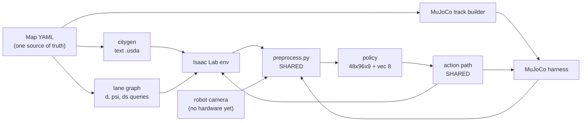

# Architecture

A readable distillation of the binding specification (SPEC v2, sections S2 to S11). Where this
document and the specification disagree, the specification wins. Section references are kept so
that any number here can be traced back to its source and its provenance class.

Contents: [robot](#1-the-robot) - [camera](#2-the-camera-and-the-observation) -
[environment](#3-the-isaac-lab-environment) - [MDP](#4-the-mdp) - [PPO](#5-ppo-from-scratch) -
[randomization](#6-domain-randomization) - [sim-to-sim](#7-sim-to-sim) -
[deployment](#8-deployment) - [budgets](#9-budgets-and-limits)

---

## 0. The shape of the system



Three modules are shared by every consumer and are the reason the pipelines cannot silently
diverge: `dr/preprocess.py` (the image chain), `camera_math.py` (the mount pose and all
convention conversions) and `wrappers/delay.py` (actuation and observation delay). Changing any
of them requires sign-off from the PPO, sim-to-sim and deployment owners, because a
one-line change there moves the sim-to-real gap without moving any test.

---

## 1. The robot

A Duckiebot-class differential-drive robot, 1.1 kg, authored entirely from primitives. Frames
follow REP-103 (x forward, y left, z up); `base_link` sits at the wheel-axle midpoint, 31.8 mm
above the ground.

| Quantity | Value | Note |
|---|---|---|
| Wheel radius | 0.0318 m | randomized x U(0.95, 1.05), plus a left/right asymmetry of +/-6% |
| Wheel baseline | 0.100 m | randomized U(0.090, 0.110) |
| Mass | 1.10 kg total (base 1.00, wheels 2 x 0.05) | randomized U(0.85, 1.40) on the base |
| Chassis collision | box 0.18 x 0.13 x 0.075 m, bottom at 21 mm | v1 had it at 6.3 mm, which produced phantom ground contacts |
| Caster | frictionless sphere r 0.0165 m at (-0.085, 0, -0.0153) | contact lands exactly at z = 0 |
| Wheel collision | **sphere** r 0.0318 m, never a cylinder | a cylinder contact model costs about 74% of yaw response on arcs |
| Wheel torque limit | 0.15 N.m | randomized U(0.06, 0.25); v1's 2.0 N.m was roughly 13x too high |
| Motor constant | 27.0 rad/s per unit duty | gain randomized U(0.60, 1.40), trim U(-0.12, +0.12) |
| Dead-band | first nonzero duty at 0.235 | below it the wheel **coasts**, it does not brake |
| Actuation delay | 0.150 s modelled | the single dominant dynamics gap |
| Encoders | 135 ticks/rev | the observation vector is quantized to this |

Robot geometry is a hand-authored URDF of boxes, cylinders and spheres. There is no
`camera_link` in it: the camera mount pose has exactly one source, the camera offset
configuration, consumed through a shared quaternion helper whose golden values are pinned by a
unit test (pitch 0 gives (0.5, -0.5, 0.5, -0.5); pitch 25.3 degrees down gives
(0.37837, -0.59736, 0.59736, -0.37837)). Two sources for a mount pose is how a rendered frame
ends up looking at the ceiling with nobody noticing.

---

## 2. The camera and the observation

### One canonical camera

The v1 plan targeted an anisotropic camera (fx 220.2, fy 238.7). That cannot be authored in
Isaac Sim 5.1: fx and fy are averaged, the aperture ratio is forced to the render aspect, and
aperture offsets are ignored outright. v2 defines a single square-pixel pinhole and makes every
pipeline produce exactly it:

```
render     192 x 128, square pixels
f          65.98 px          (= 96 / tan(55.5 deg))
hFOV       111.0 deg         (matches the rectified horizontal FOV of the real camera stack)
vFOV       88.3 deg
principal  image centre (96, 64)
clipping   (0.05, 6.0) m
```

* **Isaac** authors it as `focal_length=7.201`, `horizontal_aperture=20.955`,
  `vertical_aperture=13.970`, never through an intrinsic matrix. Because the pixels are square
  and the aperture ratio equals the render aspect, the geometry is invariant to whether Isaac
  honours or recomputes the vertical aperture.
* **MuJoCo** renders 192x128 offscreen with `fovy` 88.26 degrees.
* **The robot** rectifies directly to `K_canon = [[65.98, 0, 96], [0, 65.98, 64], [0, 0, 1]]`.
  The new camera matrix is chosen, not derived: `getOptimalNewCameraMatrix` is not used.

The far clip at 6.0 m plus 0.30 m walls stops one environment from seeing its neighbour across
the 8.0 m gap.

### Why 192 wide

Tangent projection makes the **centre** pixels the coarsest, which is the opposite of the
intuition and is why the v1 resolution analysis was optimistic. Feature subtense at image
centre, in pixels:

| Feature | 0.3 m | 0.5 m | 1.0 m | 2.0 m | 3.0 m |
|---|---|---|---|---|---|
| Yellow tape 24 mm, at render 192 | 5.3 | 3.2 | 1.6 | 0.8 | 0.5 |
| White tape 48 mm, at render 192 | 10.6 | 6.3 | 3.2 | 1.6 | 1.1 |
| Lane width 210 mm, at obs 96 | 23.1 | 13.9 | 6.9 | 3.5 | 2.3 |

A marking is usable while it subtends at least 1 pixel at **render** resolution, because the
2x supersample plus box downsample preserves its energy as reduced contrast rather than
deleting it. That gives usable lookahead of about 3.2 m on the white edge and 1.6 m on the
yellow centre line, against 0.15 m of blind travel at the worst-case delay. At v1's 64-pixel
width both were sub-pixel at centre. Going to 128 pixels wide was rejected: 78% more encoder
activation memory for no change in the 1-pixel envelope.

A 65 mm AprilTag at 1 m is 4.3 render pixels. It is not decodable, which is why signs and tags
in this project are **visual distractors only** and nothing in the pipeline detects them.

### The operator chain (single source, shared by all paths)

```
1  frame from the camera buffer, cloned (the buffer is live; aliasing here is silent)
2  float, /255
3  photometric randomization        TRAIN ONLY: exposure, gamma, contrast, saturation, white
                                    balance, motion blur, vignette, chromatic aberration,
                                    defocus, Gaussian and shot noise, JPEG-approximating DCT
4  principal-point jitter           TRAIN ONLY: integer shift +/-2 px, replicate padded, in
                                    torch (USD aperture offsets are a silent no-op)
5  fixed 5-tap Gaussian blur        ALWAYS, both axes, replicate padded, sigma 0.6 px
6  exact 2x2 box downsample         ALWAYS, identical to cv2.INTER_AREA at an integer 2x
7  crop 16 rows off the top         ALWAYS  ->  48 x 96
8  quantize to uint8                ALWAYS
9  push into the frame ring         observation delay shifts the read index
10 stack (t, t-2, t-4)              ->  48 x 96 x 9 uint8
```

The robot path is identical from step 5 onward, preceded by JPEG decode, BGR to RGB, a
sigma 1.0 px pre-blur at 640x480 and the rectification remap. Byte parity between the torch,
numpy and OpenCV implementations is asserted by tests and, for the exported graph, by the
deployment parity gate.

### Observation and action spaces

| Tensor | Shape | Contents |
|---|---|---|
| `rgb` | (48, 96, 9) uint8 | three stacked frames |
| `vec` (actor) | (8,) f32 | previous two actions, both wheel speeds (encoder-quantized, with dropout), yaw rate, odometry speed |
| `vec_priv` (critic) | (14,) f32 | `vec` plus lateral error, heading error, curvature at 0.3 m lookahead, distance and relative speed to the nearest obstacle, lane progress speed |
| `action` | (2,) f32 in [-1, 1] | forward and yaw commands |

Images are divided by 255 inside the network, never in the buffer. Vectors are normalized by a
running scaler inside the learner, never in the environment.

---

## 3. The Isaac Lab environment

A `DirectRLEnv` subclass. Direct rather than manager-based because the camera-first pattern,
the imperative obstacle and reward code and the `_reset_idx` override all need it, while the
event manager remains available through the configuration.

```
/World
  /ground        one authored plane, collision group -1, albedo randomized on an interval
  /DomeLight     BACKGROUND IMAGERY ONLY (six 2K HDRIs, yaw and tint randomized)
  /SunLight      DistantLight: the actual directional-lighting randomization axis
  /envs/env_i    spacing 8.0 m, all content inside a 3.6 m half-extent box
    /City        one of 64 layout variants, deterministically env_i mod 64
    /Robot       3 bodies, 2 degrees of freedom
    /Robot/base_link/front_cam   tiled camera 192x128, ROS convention
    /Obstacles   up to 2 NPC robots, 4 duckies, 4 cones; movers are kinematic
    /Lamp        per-environment sphere light
```

City USD carries **no physics colliders at all**. Walls are visual, 0.30 m tall. The single
physics surface is the authored ground plane. Containment is the off-drivable termination, not a
wall.

| Rate | Value |
|---|---|
| Physics timestep | 1/240 s (identical to MuJoCo, so the transfer gap has no integration-rate term) |
| Decimation | 16 |
| Control rate | 15 Hz (the deployment rate) |
| Episode | 30 s = 450 steps, about one lap of a 5x5 loop at 0.3 m/s |
| Re-renders on reset | 1, which costs about 43% extra renders at steady state and roughly 2x during early short episodes. Budgeted, not free |

---

## 4. The MDP

### Sign conventions

`d > 0` means displaced **left** of the right-lane centre line, toward the yellow tape.
`psi > 0` means the heading is rotated counterclockwise from the lane tangent. These two
sentences are load-bearing: with them, `psi_target = -clip(d/0.05, -1, 1) * 45 deg` steers back
toward the centre for both signs, and without them half the reward function is inverted.

### Action path (in order, every control step)

```
(a_v, a_om)  ->  v_cmd = 0.3 * (a_v + 1) in [0, 0.6] m/s,  om_cmd = 4.0 * a_om rad/s
1. inverse kinematics with per-episode gain, trim, baseline and per-wheel radius asymmetry
2. actuation delay: 1 to 3 control steps plus a sub-step interpolation, then a first-order lag
3. dead-band: below the threshold duty the wheel COASTS (target set to current speed)
4. brake authority: deceleration slew-limited, beta ~ U(0.4, 1.0)
5. wheel-slip noise and battery sag scale the realized target
6. write the joint velocity target
```

The same class, with a numpy twin proven equal by unit test, runs in MuJoCo and is quoted in the
deployment documentation. No physical drive parameter is ever written per reset.

### Reward

```
psi_target = -clip(d / 0.05, -1, 1) * 45 deg
e          = psi - psi_target
r_head     = 0.5 * (leaky_cos(pi*e / 10 deg) + leaky_cos(pi*e / 50 deg))
r_prog     = ds / (0.6 * dt)   if moving forward AND inside the lane gate, else 0
r_lat      = -(1 - 0.001^(|d| / (w_lane/2)))
r_smooth   = -||a - a_prev||^2
r_prox     = clip(-(p_prev - p) * 50, 0, 1.5)          pays only for OPENING a gap
stall      = 1 if body speed < 0.03 m/s

R = 1.0*r_head + 6.0*r_prog + 0.5*r_lat + 0.10*r_smooth + 1.0*r_prox - 0.5*stall
R_terminal = -10 on collision or off-drivable, 0 on truncation (which is bootstrapped)
clipped to [-20, +20]
```

The progress gate is parameterized by the episode's sampled lane width, not by a hardcoded
constant, so that lane-width randomization does not quietly change what counts as progress.
Corner cutting is watched with a pre-committed response: if the evaluation median of
time-integrated `|d|` exceeds 0.04 m.s per episode-second, the lateral weight goes to 1.0, the
run is repeated and both numbers are reported. That is the only reward change allowed after
results exist.

### Terminations

Off-drivable (any of four test points leaves a drivable tile), obstacle safety circle at
`0.12 + r_obs`, roll or pitch beyond 30 degrees, stalling longer than 2 s, or spinning
(integrated yaw beyond 3*pi with less than 0.2 m of net displacement). Truncation at 450 steps.

---

## 5. PPO from scratch

Pure PyTorch, no reinforcement-learning library, no Isaac imports, fully CPU-testable.

### Networks

Impoola-style encoder: three convolution sequences at 16, 32 and 32 channels, each a 3x3
convolution, a 3x3 max pool at stride 2 and two residual blocks; then ReLU, **global average
pooling** over the 6x12 map, and a linear projection to 256. About 107k parameters. Global
average pooling is chosen for translation insensitivity under camera-pose randomization; note
that it saves parameters, not activations, and the activation count is what sets the minibatch
size.

Actor and critic are fully separate towers, each with its own encoder. The critic consumes the
privileged 14-wide vector. A vector-only mode replaces the encoder with the identity and is
first-class, because it is what the CI learning gate and the state-based milestone use.

The policy head is a diagonal Gaussian with a single learned log-standard-deviation parameter
initialized at log(0.5) and clamped to [-5, 2]. Actions are sampled raw, the environment clips
them, and the **unclipped** action is stored. Storing the clipped action instead is the classic
silent PPO bug, and the ratio assertion exists to catch exactly that.

### GAE and the truncation bootstrap

```
for t = T-1 .. 0:
    v_next  = last_values         if t == T-1 else value[t+1]
    v_next  = term_value[t]       where truncated[t]        # exact truncation bootstrap
    delta   = reward[t] + gamma * v_next * (1 - terminated[t]) - value[t]
    A[t]    = delta + gamma * lam * (1 - done[t]) * A[t+1]
```

Terminal observations are captured **before** any state mutation, using the same delayed frame
stack the observation builder would produce, and are evaluated by one no-grad critic pass at
update time. The last rollout step gets its own bootstrap pass on the current observation.
Advantages are normalized once at batch level.

### Hyperparameters

| Parameter | Value | Why |
|---|---|---|
| envs / horizon / batch | 256 / 32 / 8192 | |
| minibatches / size | 16 / 512 | derived from the VRAM arithmetic, not chosen by feel |
| epochs | 4 | 64 gradient steps per iteration |
| gamma / lambda | 0.99 / 0.95 | about 6.7 s of horizon at 15 Hz |
| clip | 0.2 | on plateau: lower the clip or raise the environment count, never raise entropy |
| learning rate | Adam 3e-4, eps 1e-5, KL-adaptive | KL above 0.02 divides by 1.5, below 0.005 multiplies by 1.5 |
| entropy coefficient | 0.0 | exploration comes from sigma; 1e-3 only if premature determinism appears, as a logged change |
| precision | fp32 (TF32 allowed) | bf16 and fp16 autocast are forbidden |
| total steps | 100 to 150M lane following, 300 to 400M with obstacles | |
| seeds | 3 per reported number | |

### Guards, checkpointing and model selection

Five guards are permanently on (ratio equals 1 at the first minibatch, GAE against a naive
reference, camera-buffer cloning, post-reset frame change, single host sync per iteration).
Checkpoints are written atomically every 250 iterations and carry the model, optimizer, running
normalizers, **curriculum state**, all four RNG states, the config hash, the git commit and the
environment fingerprint. The learner restores bit-exactly on CPU (asserted by a test); the
environment stream restores statistically, and that distinction is stated rather than glossed.

Model selection is frozen before any run: every 250 iterations the deterministic policy is
evaluated with randomization frozen and per-step photometric randomization off, and the reported
checkpoint per seed is the best under mean lane-frame consecutive distance. Final numbers come
from the held-out maps, which the selection metric never touches.

---

## 6. Domain randomization

Three layers, each wired where it belongs:

1. **Per-step photometric**, in torch inside the preprocessing chain, never inside the PPO loss
   (augmenting there corrupts the importance ratio). The same functions run over MuJoCo frames.
2. **Per-episode scene**, writing material **scalars** only inside a single change block, with
   texture assignments happening once at startup. Runtime texture uploads would recompile
   shaders and blow the frame-time budget.
3. **Dynamics**, entirely in the action path as tensors resampled on reset. No actuator-API or
   USD writes per reset.

19 visual axes (lighting direction and intensity, colour temperature, road and tape albedo and
roughness, tape hue, marking geometry, camera mount pose, principal point, residual distortion,
backgrounds and distractors, exposure, noise, motion blur, JPEG artifacts, vignette, frame
repeat) and 18 dynamics axes (wheel radius, baseline, friction, mass and centre of mass, motor
gain and trim, battery sag, dead-band, actuation delay, observation latency, control-period
jitter, drag, slip, encoder noise, external pushes, floor patches, spawn pose, torque limit,
brake authority).

Two curriculum scalars, `alpha_vis` and `alpha_dyn`, scale every range from nominal to its
clamp. They expand when mean lane-frame consecutive distance reaches 8 tiles and contract below
4. Both are checkpointed. Task stages go from a single loop with tight spawns to all 64 layouts,
then a leading NPC, then sampled obstacle scenarios.

---

## 7. Sim-to-sim

MuJoCo is not a second opinion on the same physics: it is a different contact solver, a
different integrator and a different renderer. Matching what can be matched and measuring what
cannot is the point.

Matched by construction: timestep 1/240, decimation 16, control 15 Hz, sphere wheel colliders,
velocity actuators whose gain maps one-to-one onto the Isaac implicit drive damping, the same
force range, the same armature and joint friction, the same camera through the same helper, and
the same preprocessing bytes.

System identification runs in two stages: closed-form fixed-point recovery of effective radius,
baseline and drive gain from open-loop straights and arcs (demonstrated recovery: radius to
-0.014%, baseline to -0.5%), then Levenberg-Marquardt on armature, joint friction and damping
against per-control-step body-frame residuals. Acceptance is an open-loop endpoint error of
25 mm or less over 2.7 to 4.0 m runs, and any identified offset must already be **covered** by
the randomization ranges. If it is not, the ranges widen. The nominal value never moves.

The evaluation protocol was frozen before any tuning: 3 seeds, 200 episodes per condition, 45 s
cap, 4 held-out maps, with the decision rules listed in the README. The C1-to-C5 delta is the
headline and is framed as a robustness probe across independent implementations, never as a
real-world predictor.

---

## 8. Deployment

There is no robot. The path is built and tested anyway, offline, because a deployment path that
is written after the fact never fits the policy that was trained.

* **Two ONNX targets from one checkpoint.** Opset 13 with a static batch for TensorRT 8.2 on a
  Jetson Nano (DB21-J4), opset 18 for TensorRT 10 on an Orin Nano (DB26-J).
* **Preprocessing baked in.** By default the graph takes the stacked uint8 observation and
  performs the scaling, the frozen vector normalization, the forward pass and the conversion to
  physical units. An optional mode takes the canonical render instead and performs the blur,
  box downsample, crop and quantization inside the graph, which removes any dependence on the
  robot's OpenCV build. Both are proven byte-identical to the training chain.
* **Parity gates, all offline.** onnxruntime against torch below 1e-5 on 1000 random plus 100
  golden frames for both targets; TorchScript against torch; the baked preprocessing against
  the shared implementation to byte equality; the numpy robot tail to within 1 least-significant
  bit.
* **Sidecar JSON per artifact**: sha256, every preprocessing constant, action units and scaling,
  training commit, seed, specification version, and the TensorRT build command marked
  explicitly as documented rather than executed.
* **ROS 1 node skeleton**: keep-newest compressed image subscription, camera info consumed once
  to build the rectification map, the shared preprocessing tail in numpy, onnxruntime or
  TensorRT inference, and `Twist2DStamped` published at 15 Hz. The node never imports torch. A
  watchdog publishes zeros when the newest frame is older than 0.2 s, and shutdown publishes
  zeros five times. Forward speed is capped conservatively for first runs.

Every latency figure in the deployment documentation is labelled a design target, because no
measurement exists and none will until hardware does.

---

## 9. Budgets and limits

### VRAM at 256 environments (8 GB card)

The activation arithmetic, not the pixel count, sets the minibatch size. The encoder stores
about 389k floats per sample, which is 1.56 MB in fp32; two towers at a minibatch of 512 is
1.49 GiB. The v1 minibatch of 4096 would have needed 11.9 GiB by the same arithmetic, which is
why there are 16 minibatches and not 2.

| Item | GiB |
|---|---|
| Windows desktop reserve | 0.6 to 1.0 |
| Kit, RTX renderer, BLAS, shaders | 2.0 to 2.8 |
| City textures (16 buckets, scalar tints per variant) | 0.13 |
| Dome HDRIs (6 files, 2K cap) | 0.13 |
| Tiled render target plus G-buffers | 0.19 to 0.25 |
| PhysX GPU buffers | 0.2 to 0.3 |
| torch context, cuDNN, preprocessing transients | 0.5 |
| Rollout buffer (stacked uint8 observations, 324 MiB) | 0.34 |
| PPO activations | 1.5 |
| Parameters, gradients, Adam moments | 0.02 |
| Fragmentation slack | 0.8 |
| **Total** | **6.4 to 7.6** |

The gate is 7.2 GiB measured by `nvidia-smi`, never by torch accounting, because the renderer's
allocations are invisible to torch. Ordered fallbacks: 32 minibatches, then splitting the actor
and critic backward passes, then gradient checkpointing on the residual blocks, then 192
environments. A throughput collapse of more than 2x between adjacent sweep points is treated as
out-of-memory by spill, not as noise.

### Time

About 7 to 10 GPU-days in total: half a day for the first vision policy, 1 to 1.5 days for
randomization and curriculum, 3 days for three obstacle seeds, 1.5 to 2.5 days for the
ablations, and roughly 2 hours for the full evaluation matrix. This is exactly why the Windows
TDR and power settings are a milestone-zero requirement rather than a footnote.

### Top risks

VRAM remains the top risk, now with explicit arithmetic, a hard gate and four ordered
fallbacks. The Windows TDR device reset is a named risk with the registry mitigation and the
event log as its early signal. Re-render overhead during early training is budgeted and
measured rather than assumed free, with batched resets designed but implemented only if the
benchmark shows the run is render-bound.
